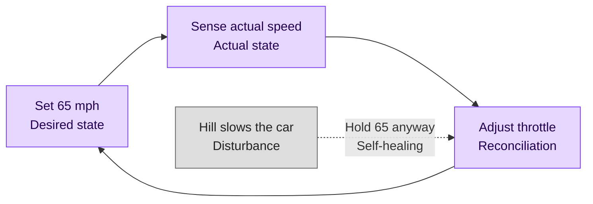
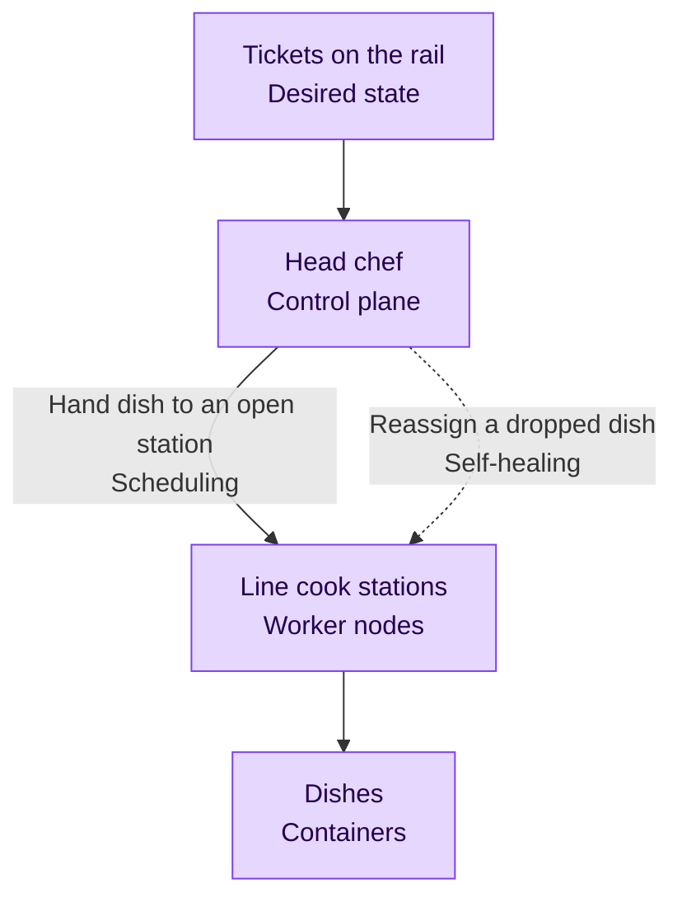
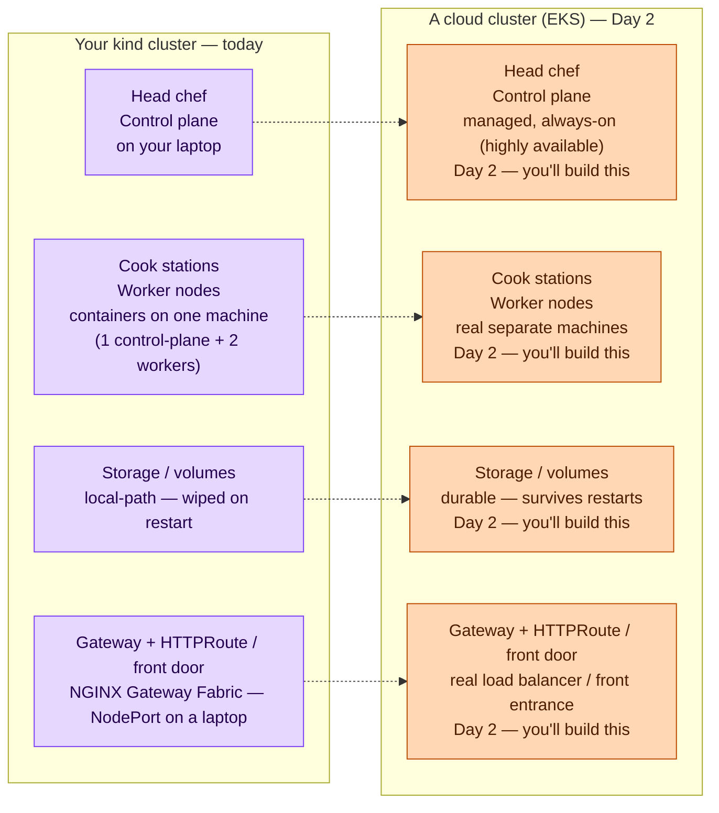

# Foundations — Instructor Guide

Foundations is the on-ramp to Day 1, covering OUTLINE segments 2-3 (9:45–10:30). It builds the one mental model the entire workshop leans on — the Kubernetes control loop — and then stands up a working local `kind` cluster, so that "just get a Pod running" in segment 4 has somewhere to run. By the end of this stage students hold a model of how a cluster thinks and a three-node cluster on their laptop to prove it.

**Opening framing (folded in from segment 1, the Intro interlude).** Foundations opens the day, so the instructor carries the workshop's promise into it: across two days, students watch a single small application — a Node/TypeScript HTTP API backed by Postgres — ride from one bare Pod to an autoscaled, GitOps-managed deployment running on a real cloud cluster. The arc has three named maturity stages, said out loud before any YAML appears: **POC** (the deliberately-wrong "before" picture — imperative, nothing in git, ephemeral), then **Stable** (declarative manifests in git, durable Postgres, the state you'd hand a teammate), then **Production** (autoscaling, GitOps, and a real EKS cluster — the state you'd hand an on-call rotation). Foundations is neither a stage nor an interlude: it is the cluster and the mental model that have to exist before the progression can begin.

**Stage at a glance.**
- **Delivers:** the Kubernetes control-loop mental model plus a working multi-node `kind` cluster on the laptop.
- **End state:** a local 3-node `kind` cluster ready for its first Pod, with students holding the cruise-control and kitchen models.
- **Next:** POC puts the application onto the cluster imperatively — the deliberately-wrong "before" picture.

**How to read this guide.** Each segment below follows a fixed section order, so under stage pressure your eye lands in the same place every time: `Goal`, then `Talking points`, then (for build segments) `Live build` and `Watch for`, then an optional `Anticipated questions`, then `Transition`. Fenced command blocks are exactly what you type on stage. Output blocks are **representative, not literal captures** — pod-name suffixes, ages, and IPs are illustrative and will differ on the day; read them for the shape and the teaching signal, never as the exact bytes you'll see. Any secret value shown anywhere in the workshop is a deliberately-fake demo value (Foundations shows none).

**Scope guard — what is explicitly out (decline these on stage without improvising).**

- No **Helm** — Kustomize is the only manifest-management tool taught (it arrives in Stable, not here).
- No **hand-written StatefulSet** for Postgres — durability is the CloudNativePG operator, taught in Stable.
- No **in-cluster observability stacks** (Prometheus, Grafana, Loki, the LGTM stack). Only built-in signals (`kubectl top`, events, rollout status) and platform-provided observability are shown, and not in Foundations.
- No **service mesh** (Istio, Linkerd, Cilium service mesh).
- No **authoring a custom operator** — the workshop consumes operators later; it never writes a controller.
- No **multi-cluster operation** — exactly one cluster at a time. Foundations runs a single `kind` cluster; EKS comes on Day 2 as a migration, never side by side.

**Binding design choices that shape Foundations.** Segments 2-3 are tagged **Foundations**, not a maturity stage and not interludes: a from-scratch Kubernetes course cannot tag them to POC because the cluster and the mental model must exist before "just get a Pod running" is even possible. Segment 2 is deliberately **no-code** — students must leave it with a model, not a manifest. Segment 3 runs a single multi-node `kind` cluster (one control-plane node, two workers); the same parts will reappear, larger, on a cloud cluster in Day 2, which is the first appearance of the workshop's recurring theme: a Kubernetes resource is a stable contract, while the controller behind it is environment-specific.

---

## Segment 2 — 9:45 — Why Kubernetes: The Mental Model

**Stage:** Foundations.
**Duration:** 15 minutes.

### Goal

Establish the single idea the rest of the workshop leans on — the Kubernetes **control loop** — using two everyday analogies before any term sounds like jargon, then name the real Kubernetes words underneath them. This segment exists so that every resource taught later (a Deployment self-healing, an HPA chasing a CPU target, Argo CD reconciling git) reads as the same one loop, not as a pile of disconnected features. No code is written; students leave with a model, not a manifest.

### Talking points

- **Cruise control is the whole control loop.** You set a desired speed — 65 mph — and the car takes over: it senses the actual speed, and whenever the two differ it adjusts the throttle to close the gap. Name the three parts as you say them: you set 65 (the **desired state**); the car reads how fast it's actually going (the **actual state**); it keeps nudging the throttle to match (**reconciliation**). Say it out loud as the reveal: *"You set the speed. The car does everything else to keep it. That's the entire idea behind Kubernetes — you'll see this exact loop in every resource we build."*
- **The loop never stops.** Stress that this is not a one-time correction — it runs continuously. On a hill the car presses the throttle harder to hold 65 against the drag: the same loop, correcting against a disturbance, is **self-healing**. Kubernetes works exactly this way — you declare the state you want, and it never stops driving the cluster toward it. Say it: *"Nobody touches the pedal on that hill — the loop just pushes harder on its own. Kill a Pod later today and watch Kubernetes do the same thing without you."*
- **Zoom out from one car to a whole restaurant kitchen** to show how a cluster is organized. Tickets on the rail are the **desired state** — every dish that's been ordered. The head chef reading the rail and assigning each dish runs the **control plane**; the line cooks at their stations, who actually cook the food (the **containers**), are the **worker nodes**. Handing a dish to a station that has room is **scheduling**. Say it as you point at the split: *"One brain reading the orders and deciding who does what — that's the control plane. The hands actually cooking — those are your worker nodes. Remember those two words; the whole cluster is just those two roles."*
- **Self-healing, now at cluster scale.** When a cook gets slammed or walks off, the chef simply reassigns that dish to another station — the same self-healing as the car holding 65, but at the level of the whole cluster rather than one engine. This is the **control plane versus worker nodes** split the rest of the workshop builds on. Say it: *"A cook walks off mid-shift — the chef doesn't panic, he just slides the order to the next station. Same loop as the car holding 65, now running the whole kitchen."*
- **These are models, not manifests.** The two diagrams below anchor each analogy to the real term — every box names the everyday thing and the Kubernetes word for it. There is deliberately no syntax in them. Defer all YAML explicitly: students should walk out with the model, and meet the manifests starting in segment 4.

Walk the cruise-control loop first. It runs forever, closing the gap between what you asked for and what is actually happening:



Then the kitchen, which shows the same loop scaled up to a whole cluster — the control plane reading orders and driving the worker nodes that do the cooking:



### Transition

Students now have the loop — desired state, actual state, reconciliation — and the control-plane-versus-worker-nodes split. Segment 3 makes that split physical: it stands up a real `kind` cluster with one control-plane node and two workers, so the kitchen has actual stations to point at before any dish gets cooked.

---

## Segment 3 — 10:00 — Your First Cluster with kind

**Stage:** Foundations.
**Duration:** 30 minutes.

### Goal

Stand up a working local Kubernetes cluster with `kind` and explore it, so students confirm they have a real place for a Pod to run before segment 4 asks for one. This segment turns the mental model into hardware-on-a-laptop: `kind` runs Kubernetes nodes as containers on the local container runtime, one control-plane node and two workers, so every part the kitchen analogy named now has a counterpart students can list with `kubectl`.

### Talking points

- **`kind` keeps the kitchen analogy honest while fitting on a laptop.** It runs the Kubernetes nodes as containers on the local container runtime: one control-plane node (the head chef) and two worker nodes (the cook stations). Every part the analogy named has a real counterpart here, and the same parts reappear, larger, on a cloud cluster in Day 2.
- **A kube-context is which kitchen `kubectl` is talking to.** Creating the cluster writes a context into the kubeconfig and makes it current; every `kubectl` command from here targets that cluster until the context changes. On Day 2 a second context (EKS) will appear, and switching contexts is how the one-cluster-at-a-time rule is enforced.
- **The resource is a contract; the controller is environmental.** Preview the workshop's recurring theme with the diagram below: a `PersistentVolumeClaim`, or a `Gateway` plus an `HTTPRoute`, is a stable declaration that stays the same across local and cloud, while the controller that satisfies it differs. On `kind`, a local-path provisioner and NGINX Gateway Fabric back those resources; on EKS, a cloud provisioner and the AWS Load Balancer Controller do. Students write neither yet — the point is that the declaration they make today keeps working when the controller behind it changes in Day 2. The cloud column names categories only, as a forward reference, not Day-1 material.

The diagram contrasts what the local cluster gives students today against what a cloud cluster (EKS) provides later:



### Live build

Confirm the container runtime is up first — `kind` builds its nodes as containers, so without a runtime nothing that follows works:

```bash
docker info
```

```text
Server:
 Containers: 0
 Server Version: 27.x
 ...
 Operating System: Docker Desktop
```

Confirm the tooling versions are present and the `kubectl` client is within one minor of the cluster version `kind` will create:

```bash
kind version
kubectl version --client
```

```text
kind v0.x.0 go1.x.x linux/amd64
Client Version: v1.3x.x
Kustomize Version: v5.x.x
```

Create the cluster from the multi-node config — one control-plane node and two workers, matching the kitchen split from segment 2. The config file lives in the pre-flight checklist's prepared materials:

```bash
kind create cluster --config manifests/day-one/kind-cluster.yaml
```

```text
Creating cluster "kind" ...
 ✓ Ensuring node image (kindest/node:v1.35.0)
 ✓ Preparing nodes
 ✓ Writing configuration
 ✓ Starting control-plane
 ✓ Installing CNI
 ✓ Installing StorageClass
 ✓ Joining worker nodes
Set kubectl context to "kind-kind"
```

Point out that the last line set the kube-context: `kubectl` now targets this cluster. List the nodes — all three should reach `Ready`, which is the proof the cluster is live:

```bash
kubectl get nodes
```

```text
NAME                 STATUS   ROLES           AGE   VERSION
kind-control-plane   Ready    control-plane   60s   v1.35.0
kind-worker          Ready    <none>          40s   v1.35.0
kind-worker2         Ready    <none>          40s   v1.35.0
```

This is the moment to map it back to the analogy out loud: one control-plane node is the head chef, two worker nodes are the cook stations. Then show where the control plane lives and what address it serves:

```bash
kubectl cluster-info
```

```text
Kubernetes control plane is running at https://127.0.0.1:PORT
CoreDNS is running at https://127.0.0.1:PORT/api/v1/namespaces/kube-system/services/kube-dns:dns/proxy

To further debug and diagnose cluster problems, use 'kubectl cluster-info dump'.
```

Close the segment by naming the current context explicitly, so students see the handle that Day 2 will switch away from:

```bash
kubectl config current-context
```

```text
kind-kind
```

### Watch for

- **A misconfigured container runtime is the one failure that can swallow this segment.** If `docker info` errors or `kind create cluster` fails because no runtime is reachable, do **not** debug it on stage — this segment is the gate for the entire workshop and the time budget will not survive a runtime rabbit hole. Point the student at the pre-flight checklist and the committed manifests at `manifests/day-one/` (which hold the cluster config and equivalent manifests) and move on; help them after the segment.
- **A skewed `kubectl` produces confusing mid-demo errors that are not the lesson.** If `kubectl version --client` shows a client more than one minor off the node version, flag it and have the student pin the matching client during a break rather than chasing odd errors live.
- **`kubectl get nodes` showing a node stuck `NotReady`** usually means the CNI is still settling — give it a few seconds and re-run before treating it as broken.

### Anticipated questions

**Q:** Is `kind` the same as Minikube or Docker Desktop's built-in Kubernetes?
**A:** Same job — a throwaway local cluster — different mechanism. `kind` ("Kubernetes IN Docker") runs each node as a container, which is what lets us get a genuine multi-node cluster on one laptop. That multi-node shape is why it maps cleanly onto the kitchen analogy and onto the cloud cluster we build in Day 2.

**Q:** Is this cluster anything like a real production cluster?
**A:** The API and the resources are identical — everything you learn here transfers. What differs is the controllers behind the resources and the durability guarantees: local-path storage gets wiped on restart, there's no real load balancer, and the control plane isn't highly available. Those are exactly the gaps the EKS capstone closes on Day 2, using the same manifests.

### Transition

Students now have a live three-node cluster and the model to reason about it. That satisfies the one prerequisite the maturity progression needed: there is somewhere for a Pod to run. Segment 4 opens the POC stage by putting the first thing on the cluster — the sample app as a single bare Pod — and the deliberately-wrong choices start there.
