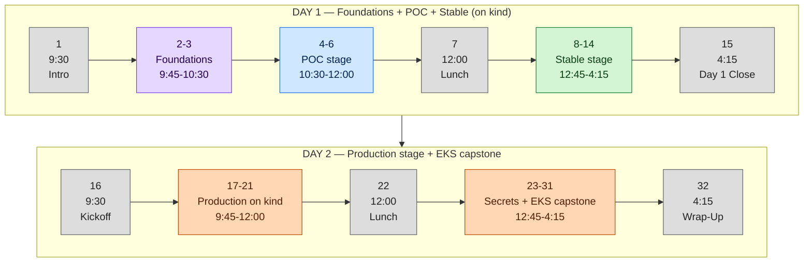
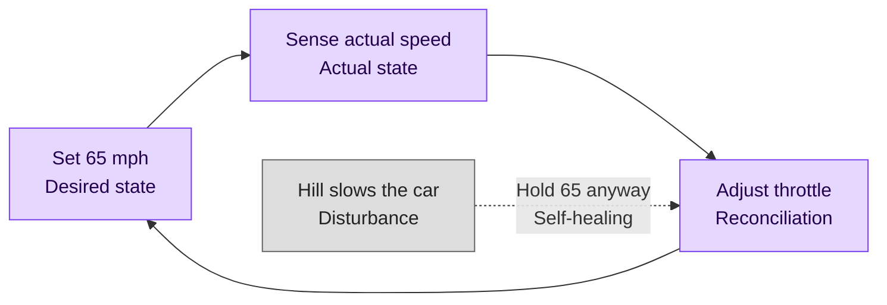
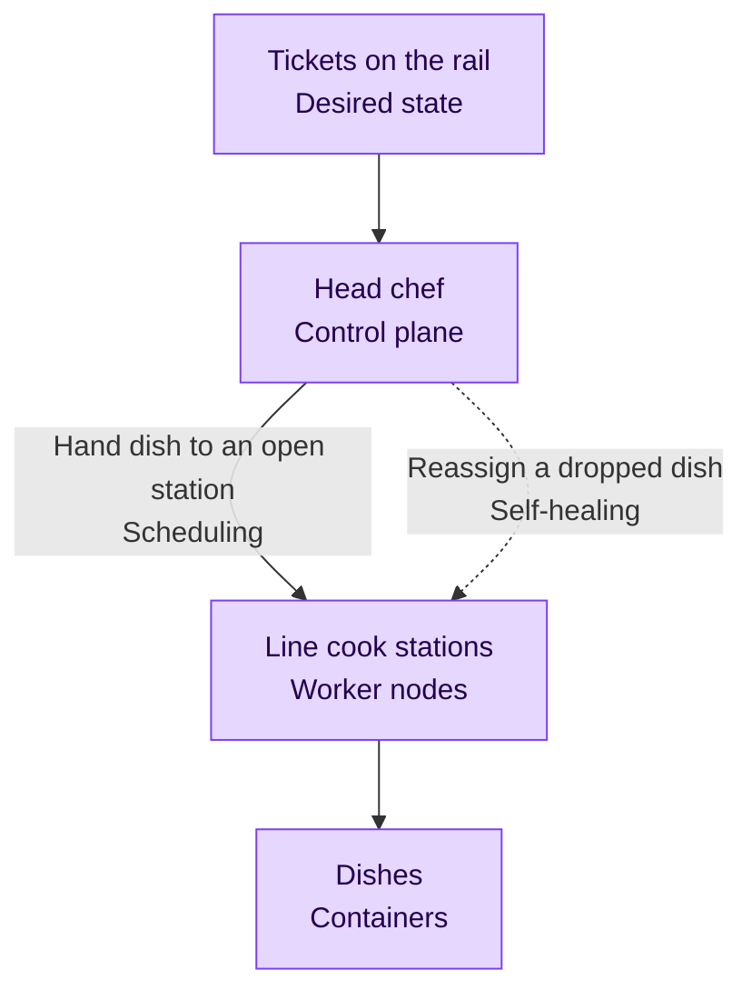
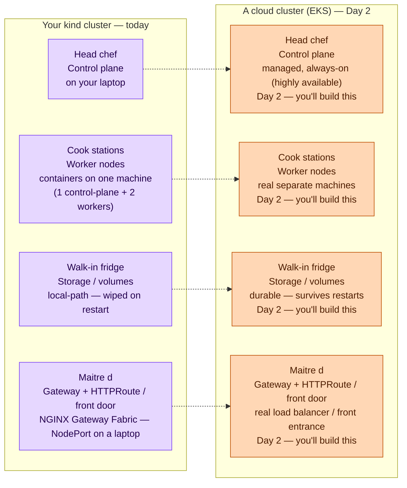

# Workshop Outline — Kubernetes

## Stage banner

This is the master spine for a **two-day**, 32-segment Frontend Masters workshop. The workshop teaches Kubernetes by progressively deploying and maturing a single small application — a Node/TypeScript HTTP API backed by Postgres — through three maturity stages, all built live:

- **POC** (segments 4-6): the app and an ephemeral Postgres deployed to a local `kind` cluster with imperative `kubectl` commands. NodePort access, no probes, no resource limits, nothing in git, database data dies on pod restart. The deliberately-wrong "before" picture.
- **Stable** (segments 8-14): declarative manifests in git. Health probes, resource requests/limits, ConfigMaps and Secrets, namespaces, a `Gateway` and `HTTPRoute`, the CloudNativePG operator giving Postgres durable PVC-backed storage, and Kustomize bases organizing the manifests. The state you would hand to a teammate.
- **Production** (segments 17-31): autoscaling, safe rollouts, PodDisruptionBudgets, RBAC least-privilege, GitOps with Argo CD, git-safe secrets with Sealed Secrets, and a minimal Amazon EKS capstone where the same app runs in the cloud. The state you would hand to an on-call rotation.

Two segments are **Foundations** (2-3): they build the cluster and the mental model before the maturity progression can begin. Six segments are **interludes** (no stage): Introduction (1), Lunch (7, 22), Day 1 Close (15), Day 2 Kickoff (16), Wrap-Up (32).

By Wrap-Up, students have watched the same application ride from a single bare Pod to an autoscaled, GitOps-managed deployment running on a real cloud cluster, and can articulate which posture is appropriate for which operating context.

### Sample application

A single Node/TypeScript HTTP API with two endpoints: a `/healthz` liveness/readiness endpoint, and one data endpoint that reads and writes a row in Postgres (a visit counter or notes list — full spec in TDD §4). It is deliberately trivial. Its only job is to make orchestration concepts real: the data endpoint proves database state survives a pod restart, and a CPU-bound path on the data endpoint gives the autoscaling demo something to react to. There is no frontend framework, no auth, no routing beyond the two endpoints. Any deviation is scope creep.

### Scope — explicitly out

The following are named so the instructor can decline them on stage without improvising a rationale:

- **Helm.** Kustomize is the only manifest-management tool taught.
- **Hand-written StatefulSets.** Postgres durability is taught through the CloudNativePG operator (see design choices below). A talking point in segment 13 explains what CNPG manages under the hood so the primitive is not a black box.
- **In-cluster observability stacks** (Prometheus, Grafana, Loki, the LGTM stack). Only built-in (`kubectl top`, events, rollout status) and platform-provided (EKS CloudWatch Container Insights) observability is shown. `metrics-server` (segment 17) and the Sealed Secrets controller (segment 23) are treated as core tooling — hard dependencies of the autoscaling and secrets lessons — not as observability stacks.
- **Service mesh** (Istio, Linkerd, Cilium service mesh).
- **Authoring a custom operator.** The workshop *consumes* CloudNativePG; it does not write a controller.
- **Multi-cluster operation.** The workshop operates exactly one cluster at a time — `kind` through the Day 2 morning, then EKS. The Day 2 afternoon is a migration, not simultaneous fleet management (see design choices). Multi-cluster federation, Cluster API, and bare-metal cluster bootstrapping are likewise out.

## Design choices owned by this outline

The TDD defers several decisions to the OUTLINE author. The choices below are binding for this workshop; POC.md, STABLE.md, and PRODUCTION.md are written against them.

### CloudNativePG from Stable; no raw StatefulSet (TDD §5.2)

Postgres becomes durable in segment 13 by installing the CloudNativePG operator and declaring a `Cluster` custom resource. Students do **not** hand-write a StatefulSet, headless Service, and PVC. Rationale:

- The operator pattern (CRDs, control loops, reconciliation) is a defining Kubernetes concept. Routing the database tier through an operator is the only way it earns a segment in a workshop this size.
- Concept budget. Hand-writing a correct StatefulSet plus teaching the operator that replaces it would spend two segments where one suffices.
- The primitive is not hidden. Segment 13 includes a talking point: "CNPG manages Pods and PVCs for you the way you would with a StatefulSet, plus failover and backup." Students leave knowing the StatefulSet exists and what problem the operator solves on top of it.

STABLE.md authors: do not hand-write a StatefulSet in segment 13's Live build. If a student asks, the answer is "you could express durable Postgres with a StatefulSet by hand; the operator does that and manages failover, which is why we reach for it."

### EKS is full follow-along; teardown is a mandatory segment (TDD §6)

The Day 2 cloud capstone (segments 24-30) is built by every student on their own AWS account, not demonstrated by the instructor alone. This is a deliberate escalation from the prior CI/CD workshop's "demo-only" cloud segments. Two binding consequences:

- **`eksctl create cluster` is kicked off at the top of segment 23, not in the EKS segment itself.** An EKS control plane takes 15-20 minutes to provision. The instructor starts provisioning in the first two minutes of segment 23 (GitOps Secrets with Sealed Secrets), so the cluster builds in the background during a self-contained `kind`-only teaching segment. By segment 24 the cluster is up and the EKS segment can use it immediately instead of waiting on it.
- **Segment 30 (Tearing It Down) is not optional and not a footnote.** An EKS control plane, its nodes, EBS volumes, and the load balancer all bill by the hour. The teardown is a full segment with a scripted `eksctl delete cluster` and an explicit check for orphaned EBS volumes and load balancers. PRODUCTION.md authors must treat segment 30 as load-bearing teaching content, not housekeeping.

### One cluster at a time; the Day 2 afternoon is a migration (TDD §6)

The workshop operates exactly one cluster at any moment. `kind` carries Day 1 and the Day 2 morning; the afternoon stands the same application up on a single EKS cluster. The `kind` cluster is not deleted — it sits idle on the laptop as a fallback — but it is never operated, compared live, or reconciled alongside EKS.

This is a deliberate correction. Once Kustomize overlays and Argo CD were in the design, the tempting reading was to run both clusters at once and have a single Argo CD fan out across them. That is multi-cluster GitOps — a genuinely intermediate topic, requiring external-cluster registration and credentials — and this workshop's audience is developers who have never operated a single cluster. PRODUCTION.md authors must NOT register the EKS cluster as an external cluster in the `kind` Argo CD, and must not demonstrate the two clusters side by side. Each cluster runs its own Argo CD reconciling its own overlay.

The portability lesson is delivered in full: the same Kustomize base runs on a real cloud cluster via an `eks` overlay. Students see a migration — one cluster, then another — not a fleet.

### Secrets management: imperative in Stable, CNPG-owned, Sealed Secrets for GitOps (TDD §7)

No plaintext secret is ever committed to the workshop's public repository. Secrets are a deliberate thread across all three stages:

- **POC** — the Postgres password is a literal in a `kubectl` command. Named as wrong: it lands in shell history and on the screenshare.
- **Stable, segment 10** — the password moves into a `Secret` object created imperatively with `kubectl create secret`, not committed to git. The instructor states plainly that a Secret is base64-encoded, **not encrypted**. The new gap is named: the Secret exists only in the cluster, so the "declarative" setup is not actually complete.
- **Stable, segment 13** — CloudNativePG generates and owns the database credentials in its own auto-created Secret; the hand-rolled Secret is retired and the app references the CNPG `-app` Secret. By end of Day 1 no human has authored the production database password and nothing secret is in git.
- **Production, segment 23** — git is now the source of truth via Argo CD, so the remaining secret state must become git-safe. The instructor installs the Sealed Secrets controller, encrypts the Secret into a `SealedSecret` custom resource with `kubeseal`, and commits the encrypted resource. The controller decrypts it back into a real Secret in-cluster.

Two binding instructions for STABLE.md and PRODUCTION.md authors:

- **Per-cluster key.** A `SealedSecret` is encrypted against one cluster's controller key, so each cluster needs its own. The `kind` overlay carries a `SealedSecret` sealed for `kind`; the `eks` overlay carries one sealed for EKS. Segment 28 installs the Sealed Secrets controller on EKS and seals the EKS copy. This is taught as a property of how Sealed Secrets works — not as a cross-cluster problem to engineer around, and not as an excuse to wire the two clusters together.
- **Recording hygiene.** Every secret value shown on screen is an obviously-fake demo value (e.g., `demo-not-a-real-password`); CNPG-generated values are random per cluster and safe to display. The `workshop` branch ships a `.gitignore` entry for plaintext Secret manifests so a student following along cannot commit one by accident.

### Foundations tag for segments 2-3 (two-day adaptation)

The prior CI/CD workshop tagged every non-interlude segment to a maturity stage because students arrived with a working GitHub repository. A from-scratch Kubernetes course cannot: the cluster and the mental model must exist before "just get a Pod running" is even possible. Segments 2-3 are therefore tagged **Foundations** — they are neither interludes (they carry heavy teaching content) nor part of the deliberately-wrong POC end-state. POC.md covers Foundations and POC together.

### Kustomize bases in Stable, overlays in Production (TDD §8)

Kustomize is introduced twice. Segment 14 introduces **bases** — a `kustomization.yaml` over the growing pile of Stable manifests, because organizing a dozen manifests is a real Stable-stage pain. Segment 27 introduces **overlays** — a `kind` overlay and an `eks` overlay over the shared base — because a real cloud cluster needs different values (storage class, gateway class, replica count) than `kind` did. Overlays express that difference; they are not a mechanism for operating two clusters at once. Splitting the introduction keeps each half motivated by a concrete need.

### Two Gateway controllers on purpose (TDD §6.3)

`kind` runs NGINX Gateway Fabric (segment 11); EKS runs the AWS Load Balancer Controller fronting an ALB (segment 26). The workshop deliberately uses two controllers, selected per environment by the `GatewayClass` a `Gateway` points at, so students see that a `Gateway` plus an `HTTPRoute` is a stable contract while the controller behind it is environment-specific. This is the same lesson the storage segments teach with the local-path provisioner versus the EBS CSI driver.

### Day 1 closes with a recap interlude (two-day adaptation)

The CI/CD workshop folded end-of-stage recaps into the final segment of each stage. This outline keeps that for the end of POC (segment 6) and end of Stable (segment 14), but adds a dedicated **Day 1 Close** interlude (segment 15) and a **Day 2 Kickoff** interlude (segment 16). Students leave overnight; a clean recap-and-preview at the day boundary is worth a 15-minute segment on each side.

## Branch reference

Each stage's completed reference solution lives on a corresponding branch in this repository. Students who fall behind, want to compare against a known-good end-state, or are reading along after the workshop can check out the branch to see the end-of-stage repository state byte-for-byte.

| Branch | What's on the branch |
| --- | --- |
| `workshop` | Sample app source + `Dockerfile` only. No Kubernetes manifests. The student starting point. |
| `poc` | `workshop` content + the `kind` cluster config + a `k8s/poc/` folder holding the manifests equivalent to the imperative `kubectl` commands run live in segments 4-6. |
| `stable` | `poc` content + declarative `k8s/base/` (Deployment, Service, `Gateway`, `HTTPRoute`, probes, ConfigMap, Secret, namespace) + the CloudNativePG operator install + a Postgres `Cluster` manifest + `kustomization.yaml`. |
| `production` | `stable` content + HPA + rollout strategy + PodDisruptionBudget + RBAC manifests + the Sealed Secrets controller install + `SealedSecret` manifests (one per overlay) + Argo CD `Application` manifests + Kustomize overlays (`overlays/kind`, `overlays/eks`) + the `eksctl` cluster config + a gp3 StorageClass + the AWS Load Balancer Controller `GatewayClass` + the ALB `Gateway`/`HTTPRoute`. |

The branches are linearly related: `poc` is branched from `workshop`, `stable` from `poc`, `production` from `stable`. As a result, `git diff poc..stable` shows the diff Stable adds on top of POC, and `git diff stable..production` shows the diff Production adds on top of Stable.

For per-stage cluster prerequisites and AWS setup the instructor must complete before running that stage, see `README.md` on each branch.

## Day shape

## Pre-flight checklist

The instructor verifies every item below before each day starts. The recommended cutoff is 30 minutes before segment 1 (Day 1) and before segment 16 (Day 2).

### Show-stoppers (verify first)

- [ ] **A container runtime is running locally.** `kind` builds its nodes as containers; Docker Desktop or Podman must be running. Verify with `docker info` (or `podman info`) — must return without error. Why it matters: `kind create cluster` in segment 3 fails immediately with no runtime, and segment 3 is the gate for the entire workshop.
- [ ] **`kind` and `kubectl` are installed and version-pinned.** Verify with `kind version` and `kubectl version --client`. The `kubectl` minor version must be within one minor of the cluster Kubernetes version `kind` creates. Why it matters: a skewed `kubectl` produces confusing errors mid-demo that are not the lesson.
- [ ] **The AWS account has `eksctl`-sufficient IAM permissions.** Day 2 only. Verify `aws sts get-caller-identity` returns a result, and confirm the principal can act on CloudFormation, EC2, EKS, IAM, and VPC. Why it matters: `eksctl` provisions EKS via CloudFormation and will fail partway through segment 23 if any of those permissions is missing — leaving a half-built stack that also has to be cleaned up.
- [ ] **The sample app image is published to a public registry with a pinned tag.** Verify the image pulls with no credentials (`docker pull <registry>/<image>:<tag>`). Why it matters: `kind` loads the image directly and EKS pulls the same image from the same registry; a private or unpinned image breaks segment 4 on `kind` and segment 24 on EKS.

### Sample app

- [ ] The sample app builds locally and the image runs; `/healthz` returns `200` and the data endpoint reads and writes against a local Postgres. Spec: TDD §4.
- [ ] The `workshop` branch holds only the app source and `Dockerfile` — no `k8s/` directory. Students branch from here.
- [ ] The image tag the manifests reference matches the tag published to the registry.

### Local cluster (kind)

- [ ] `kind create cluster` succeeds with the multi-node config file (one control-plane node, two workers); `kubectl get nodes` shows all three `Ready`.
- [ ] The NGINX Gateway Fabric NodePort install (Gateway API standard-channel CRDs, NGF CRDs, the NodePort controller variant) is verified end-to-end on `kind` against a throwaway Service, with the version refs pinned.
- [ ] `metrics-server` installs cleanly on `kind` (the autoscaling demo, segment 17, depends on it).

### AWS / EKS (Day 2)

- [ ] `eksctl` is installed and version-pinned (`eksctl version`).
- [ ] The minimal `eksctl` cluster config is prepared: a managed nodegroup, a small instance type, two nodes. No add-ons beyond what segments 25-26 install live.
- [ ] The AWS Load Balancer Controller is pinned to **v3.0.0 or later** (where Gateway API → ALB went GA), and its real `v3_X_Y_full.yaml` filename is resolved — the `latest` placeholder 404s on literal paste (segment 26).
- [ ] `cert-manager` is version-pinned and verified to install via `kubectl apply` on a scratch cluster — the LBC v3 manifest install depends on it.
- [ ] The LBC Gateway API CRDs ref is pinned, and the Gateway API standard-channel CRDs install cleanly on EKS (segment 26 applies them before the controller).
- [ ] The teardown command is prepared and has been tested end-to-end on a scratch cluster (`eksctl delete cluster`), including the post-delete check for orphaned EBS volumes and load balancers.
- [ ] Cost expectation is written into the student-facing prerequisites: the EKS control plane, nodes, EBS volumes, and load balancer bill by the hour, and segment 30's teardown is mandatory.

### GitHub / Argo CD

- [ ] The workshop repository is public so Argo CD can pull manifests with no credentials.
- [ ] The Argo CD install manifest URL and version are pinned.
- [ ] The `production` reference branch's `Application` manifests point at the public repo and the correct overlay paths.

### Secrets

- [ ] The `kubeseal` CLI is installed and version-pinned (`kubeseal --version`) — it is the tool segment 23 uses to encrypt Secrets.
- [ ] The Sealed Secrets controller install manifest URL and version are pinned, and the controller version is compatible with the `kubeseal` CLI version.
- [ ] Every Secret value used anywhere in the workshop is an obviously-fake demo value. The screenshare recording is permanent.
- [ ] The `workshop` branch carries a `.gitignore` entry covering plaintext Secret manifests so follow-along students cannot commit one by accident.

### Local environment and screenshare

- [ ] Editor and terminal font size is at or above 18pt for screenshare legibility.
- [ ] Terminal contrast is high; the cursor is visible. `kubectl` output is wide — confirm it does not wrap unreadably.
- [ ] Browser zoom is at 125% or higher for the Argo CD UI tour and the AWS console.
- [ ] Screenshare is verified end-to-end in the actual workshop tool. Workshop wifi reaches `github.com`, the container registry, and the AWS APIs.
- [ ] Mobile-hotspot fallback is configured and tested. The instructor can switch the laptop's network in under 60 seconds.

### Failure-mode preparation

- [ ] Pre-recorded screenshots of healthy end-states at each stage are saved locally: green `kubectl get pods`, the Argo CD sync view, the EKS cluster in the console.
- [ ] A fallback pre-provisioned EKS cluster exists, in case a student's or the instructor's live `eksctl create cluster` fails. Provisioning is the single longest-pole live operation in the workshop.
- [ ] A printed copy (or second-screen view) of this OUTLINE.md is available.

## Segment index

The agenda below covers all 32 FEM segments across two days. Stage-tagged segments link to the matching H2 in the corresponding stage doc using the anchor convention `<stage>.md#segment-N--HHMM--segment-title` (TDD §9.2). Forward links resolve once the stage docs are written.

---

## Day 1

### Segment 1 — 9:30 — Introduction

**Stage:** Interlude.

The instructor opens with the workshop's promise: across two days, students will watch a single application ride from one bare Pod to an autoscaled, GitOps-managed deployment running on a real cloud cluster. The instructor reveals the sample app (TDD §4) and walks the day-shape diagram. The three-stage progression (POC → Stable → Production) is named explicitly so students hear the framing before any YAML appears. No code is written.

**Time-budget warning:** The Introduction is 15 minutes. Resist summarizing all of Kubernetes here; segment 2 is when concepts start landing.

---

### Segment 2 — 9:45 — Why Kubernetes: The Mental Model

**Stage:** Foundations.

No code. The instructor establishes the one idea the rest of the workshop leans on — a Kubernetes **control loop** — through two everyday analogies, then names the real terms underneath them.

First, **cruise control**. You set a desired speed — 65 mph — and the car takes over: it senses the actual speed, and whenever the two differ it adjusts the throttle to close the gap. That is the whole control loop. You set 65 (the **desired state**); the car reads how fast it's actually going (the **actual state**); and it keeps nudging the throttle to match (**reconciliation**). The instructor stresses that this never stops — it is not a one-time correction but a loop running continuously. On a hill the car presses the throttle harder to hold 65 against the drag: the same loop, correcting against a disturbance, is **self-healing**. Kubernetes works exactly this way — you declare the state you want, and it never stops driving the cluster toward it.

Then the instructor zooms out from one car to a whole **restaurant kitchen** to show how a cluster is organized. Tickets on the rail are the **desired state** — every dish that's been ordered. The head chef reading the rail and assigning each dish runs the **control plane**; the line cooks at their stations, who actually cook the food (the **containers**), are the **worker nodes**. Handing a dish to a station that has room is **scheduling**. And when a cook gets slammed or walks off, the chef simply reassigns that dish to another station — **self-healing**, now at the level of the whole cluster rather than one car. This is the **control plane versus worker nodes** split the rest of the workshop builds on.

The two diagrams below anchor each analogy to the real term. Every box names the everyday thing and the Kubernetes word for it. They are models, not manifests — there is deliberately no syntax in them.

The cruise-control loop runs forever, closing the gap between what you asked for and what is actually happening:

The kitchen shows the same loop scaled up to a whole cluster — the control plane reading orders and driving the worker nodes that do the cooking:

The instructor explicitly defers all syntax — students should leave this segment with a model, not a manifest.

---

### Segment 3 — 10:00 — Your First Cluster with kind

**Stage:** Foundations.

The instructor installs `kind`, runs `kind create cluster` with the multi-node config, and explores the result: `kubectl get nodes`, `kubectl cluster-info`, and what a kube-context is. Students confirm a working local cluster. This segment exists so that "just get a Pod running" in segment 4 has somewhere to run.

The `kind` cluster keeps the kitchen analogy honest while staying small enough to run on a laptop: `kind` runs the Kubernetes nodes as containers on the local container runtime — one control-plane node and two workers. Every part the analogy named has a real counterpart here, and the same part will reappear, larger, on a cloud cluster in Day 2. The diagram below contrasts what the local cluster gives students today against what a cloud cluster (EKS) provides later — the cloud column names categories only, as a forward reference, not Day-1 material:

The storage and networking rows are where the workshop's recurring theme first bites: the Kubernetes resource — a `PersistentVolumeClaim`, or a `Gateway` plus an `HTTPRoute` — is a stable contract that stays the same across both columns, while the controller that satisfies it is environment-specific. On `kind` a local-path provisioner and NGINX Gateway Fabric back those resources; on EKS a cloud provisioner and the AWS Load Balancer Controller do. Students will not write either yet; the point is that the same declaration they make today keeps working when the controller behind it changes in Day 2.

**Time-budget warning:** 30 minutes covers install plus first-cluster exploration. If a student's container runtime is misconfigured, do not debug it on stage — point them at the pre-flight checklist and the `poc` branch and move on.

---

### Segment 4 — 10:30 — Pods: Running the Sample App

**Stage:** POC.

The first thing on the cluster. The instructor runs the sample app as a single bare Pod with imperative `kubectl run`, then explores it: `kubectl get`, `describe`, `logs`, `exec`. Then the instructor deletes the Pod — and it is simply gone, nothing brings it back. That deliberate deletion is the segment's payoff: it motivates the Deployment in segment 5.

---

### Segment 5 — 11:00 — Deployments & Self-Healing

**Stage:** POC.

The bare Pod becomes a Deployment via imperative `kubectl create deployment`. The instructor scales it, deletes a Pod from under it, and watches the ReplicaSet recreate it — self-healing made visible. Postgres also enters here, as a second Deployment with no volume (deliberately ephemeral). Both halves of the app now run, still entirely through imperative commands.

---

### Segment 6 — 11:30 — Services & Wiring the App to Postgres

**Stage:** POC. End of POC stage.

Pods get IP addresses that churn; Services give stable names. The instructor creates a `ClusterIP` Service for Postgres so the app can find it by DNS, and a `NodePort` Service for the app so it is reachable from the host. The full app-plus-database stack now runs on `kind`.

The end-of-POC recap closes the stage: a working deployment built entirely with imperative commands — nothing in git, NodePort access, no probes, no resource limits, and a database whose data dies on every pod restart. The instructor names these as the problems Stable will solve.

---

### Segment 7 — 12:00 — Lunch

**Stage:** Interlude.

No teaching content. Students return at 12:45. The instructor verifies the segment-8 demo is staged and confirms the `poc` branch matches what was just built.

---

### Segment 8 — 12:45 — From Imperative to Declarative

**Stage:** Stable.

The conceptual hinge of Day 1. Every imperative command from the morning is rewritten as a manifest committed to git. The instructor introduces `kubectl apply`, `kubectl diff`, and labels and selectors written by hand, then re-creates the app and Postgres declaratively. The talking point: imperative commands are how you *explore*; manifests are how you *operate*.

**Time-budget warning:** This segment is 45 minutes — the longest of the workshop — because it reframes everything from the morning. Do not rush it; the rest of Stable assumes students are fluent reading a manifest.

---

### Segment 9 — 1:30 — Health Checks & Resource Management

**Stage:** Stable.

Kubernetes cannot tell a healthy Pod from a wedged one without help. The instructor adds readiness, liveness, and startup probes to the app's Deployment, then adds resource requests and limits. The instructor breaks the app's health endpoint on purpose to show the probe catching it and the Pod being restarted.

---

### Segment 10 — 2:00 — ConfigMaps, Secrets & Namespaces

**Stage:** Stable.

Configuration moves out of inline environment variables. The database connection details become a ConfigMap; the database password becomes a Secret. The instructor is explicit that a Kubernetes Secret is base64-encoded, not encrypted, and what that means. Namespaces are introduced as the boundary that will separate the app's resources from cluster tooling.

---

### Segment 11 — 2:30 — Gateway API

**Stage:** Stable.

The `NodePort` from POC is replaced. The instructor installs NGINX Gateway Fabric on `kind`, then writes a `Gateway` (a listener) and an `HTTPRoute` (host and path routing to the app's Service). The talking point separates the route — a `Gateway` plus an `HTTPRoute`, a stable contract — from the controller that fulfills it (environment-specific, named by the `GatewayClass` the `Gateway` points at) — a distinction segment 26 pays off on EKS.

---

### Segment 12 — 3:00 — Operators & CRDs

**Stage:** Stable.

The operator pattern, taught as a concept before it is used. CustomResourceDefinitions extend the Kubernetes API; an operator is a control loop watching custom resources and reconciling them. The instructor installs the CloudNativePG operator and shows the new CRDs it registered. No database is created yet — this segment is about the pattern.

---

### Segment 13 — 3:30 — Durable Postgres with CloudNativePG

**Stage:** Stable.

The ephemeral Postgres Deployment from POC is replaced by a CloudNativePG `Cluster` custom resource. Storage is now a PVC bound through a StorageClass; the instructor restarts the database Pod and the data survives. The app is reconfigured to talk to the CNPG-managed `-rw` Service.

A required talking point (per design choices above): the instructor explains that CNPG manages Pods and PVCs much as a hand-written StatefulSet would, and adds failover and backup on top — so students know the StatefulSet primitive exists and what the operator buys over it.

---

### Segment 14 — 4:00 — Organizing Manifests with Kustomize

**Stage:** Stable. End of Stable stage.

Stable has accumulated a dozen manifests. The instructor introduces a Kustomize **base**: a `kustomization.yaml` collecting the manifests, applied with `kubectl apply -k`. No new behavior — this is housekeeping that segment 27's overlays will build on.

The end-of-Stable recap closes the stage: the app is declarative, probed, resource-bounded, gateway-fronted, and durably backed by Postgres. The instructor names what is still wrong: it runs on exactly one local cluster, scaling is manual, a bad deploy takes the app down with no rollback discipline, the workload runs under an over-permissioned default ServiceAccount, and there is no story for surviving a node going away. Production will solve all of it.

**Time-budget warning:** Segment 14 is 15 minutes. Keep the Kustomize introduction to "base only." Overlays are segment 27 — do not preview them here.

---

### Segment 15 — 4:15 — Day 1 Close

**Stage:** Interlude.

The instructor replays the Day 1 half of the day-shape diagram: imperative POC to declarative Stable. Students are told exactly what state to leave their cluster in overnight (or that they can check out the `stable` branch tomorrow morning), and the Day 2 arc — Production and the EKS capstone — is previewed in two sentences. No new content.

---

## Day 2

### Segment 16 — 9:30 — Day 2 Kickoff

**Stage:** Interlude.

A short re-entry. The instructor recaps the end-of-Stable state, confirms everyone has a working `stable` cluster (or helps them check out the branch), and names the Day 2 promise: by 4:15 the same app autoscales, rolls out safely, is RBAC-scoped, keeps its secrets git-safe, is driven by Argo CD from git, and runs on Amazon EKS.

---

### Segment 17 — 9:45 — Autoscaling with HPA

**Stage:** Production.

The first Production segment. The instructor installs `metrics-server` on `kind`, then writes a HorizontalPodAutoscaler targeting the app's Deployment on CPU. A load generator drives traffic at the data endpoint and students watch the replica count climb, then settle when the load stops.

**Time-budget warning:** `metrics-server` needs a moment to populate before the HPA reports metrics. Install it first thing and let it warm up while explaining the HPA spec, or the demo shows `<unknown>` for an awkward minute.

---

### Segment 18 — 10:15 — Safe Rollouts & Rollbacks

**Stage:** Production.

The instructor covers the Deployment rolling-update strategy — `maxSurge`, `maxUnavailable`, and how readiness probes gate the rollout. Then a deliberately broken image is rolled out; students watch the rollout stall rather than take the app down, and the instructor recovers with `kubectl rollout undo`.

---

### Segment 19 — 10:45 — PodDisruptionBudgets & Node Drains

**Stage:** Production.

What happens when a node goes away on purpose. The instructor explains voluntary versus involuntary disruption, writes a PodDisruptionBudget for the app, and runs `kubectl drain` on a worker node — the PDB plus multiple replicas keep the app serving throughout.

---

### Segment 20 — 11:05 — RBAC & Least Privilege

**Stage:** Production.

The workload has been running under the namespace's default ServiceAccount, which is broader than it needs. The instructor creates a dedicated ServiceAccount, a Role scoped to exactly what the app needs, and a RoleBinding, then assigns it to the Deployment. The framing is least privilege: a workload should be able to do its job and nothing else.

---

### Segment 21 — 11:30 — GitOps with Argo CD

**Stage:** Production.

The deploy mechanism changes. Instead of the instructor running `kubectl apply`, git becomes the source of truth and a reconciler keeps the cluster matching it. The instructor installs Argo CD on `kind`, tours its UI, and points an `Application` at the repository's Kustomize base. A commit to the repo is shown syncing to the cluster; a hand-edit to a live resource is shown as drift in the UI.

**Time-budget warning:** 30 minutes is enough for install plus one synced `Application` only. If the Argo CD install drags, move the drift demonstration to segment 28 and keep this segment to "installed and one app synced."

---

### Segment 22 — 12:00 — Lunch

**Stage:** Interlude.

No teaching content. Students return at 12:45. The instructor confirms the `eksctl` cluster config and AWS credentials are ready — `eksctl create cluster` is kicked off at the top of segment 23 and provisions in the background through the Sealed Secrets build.

---

### Segment 23 — 12:45 — GitOps Secrets with Sealed Secrets

**Stage:** Production.

The conclusion of the GitOps arc started in segment 21. Argo CD reconciles everything from git, but the Postgres Secret was deliberately kept out — committing it to a public repo would leak it, and base64 is not encryption. The instructor installs the Sealed Secrets controller (a second instance of the operator pattern from segment 12), uses the `kubeseal` CLI to encrypt the Secret into a `SealedSecret` custom resource, commits that to the repo, and watches the controller decrypt it back into a real Secret in the cluster. The encrypted `SealedSecret` is safe in public git, and GitOps has no remaining gap.

**Time-budget warning:** The instructor runs `eksctl create cluster` in the first two minutes of this segment — before teaching anything — so the EKS cluster provisions in the background during the Sealed Secrets build (provisioning takes 15-20 minutes; this `kind`-only segment is the productive wait). If a student's cluster fails to come up, point them at the fallback pre-provisioned cluster and keep going.

---

### Segment 24 — 1:15 — Going to the Cloud: Your EKS Cluster

**Stage:** Production.

The EKS cluster kicked off during segment 23 is now up. The instructor tours it: the managed control plane, what EKS runs for you, the new `kubectl` context, and what it all costs. There is no long provisioning wait — that already happened under segment 23. Students confirm `kubectl get nodes` against their own cloud cluster, and the instructor names what still has to be done to bring it to the `kind` cluster's baseline (storage, networking, the Sealed Secrets controller).

---

### Segment 25 — 1:35 — Cluster Storage & the EBS CSI Driver

**Stage:** Production.

The `kind` local-path provisioner does not exist on EKS. The instructor enables the EBS CSI driver and creates a gp3 StorageClass, then shows that the CloudNativePG `Cluster` — unchanged — now binds its PVCs to real EBS volumes. The lesson: the manifest is portable; the storage class behind it is environmental.

---

### Segment 26 — 2:05 — Cloud Networking & the AWS Load Balancer Controller

**Stage:** Production.

The EKS counterpart to segment 11. The instructor installs the AWS Load Balancer Controller; the same `Gateway` and `HTTPRoute` now provision a real ALB instead of being fulfilled by NGINX Gateway Fabric, selected by a different `GatewayClass`. This is the payoff of the "the route is a contract, the controller is environmental" framing from Day 1.

---

### Segment 27 — 2:35 — Environment Overlays with Kustomize

**Stage:** Production.

EKS needs different values than `kind` did: a different storage class, a different gateway class, a different replica count. Instead of editing the manifests, the instructor adds an `eks` overlay over the segment-14 base — a small set of patches — and pairs it with a `kind` overlay recording the values `kind` used. The base is untouched. The framing is "a real cloud cluster needs different values, and an overlay is how Kustomize expresses that difference" — not two environments operated side by side.

---

### Segment 28 — 3:05 — GitOps on EKS

**Stage:** Production.

The Day 2-morning GitOps lesson, repeated in the cloud. The instructor installs Argo CD on the EKS cluster — the same install as segment 21 — and points an `Application` at the `eks` overlay. The git repository that drove `kind` now drives EKS; a commit syncs, and the instructor revisits drift detection in the Argo CD UI. Argo CD lives in the cluster it manages: there is no external-cluster registration and no fan-out across clusters (see "One cluster at a time" in the design choices).

Sealed Secrets closes the same way. Because a `SealedSecret` is encrypted against one cluster's key, the `eks` overlay carries its own copy; the instructor installs the Sealed Secrets controller on EKS and seals the EKS copy of the Postgres Secret. This is presented as a property of how Sealed Secrets works, not a multi-cluster problem to engineer around.

---

### Segment 29 — 3:35 — Built-in & Platform Observability

**Stage:** Production.

Observability without deploying an in-cluster stack. The instructor walks `kubectl top`, cluster and Pod events, and `kubectl rollout status` as the always-available built-in signals, then shows EKS CloudWatch Container Insights as the platform-provided option.

**Time-budget warning:** This segment is 15 minutes. Keep it to the built-in signals plus a quick Container Insights look. Where a real Prometheus or Grafana stack would go, and why this workshop stops short of installing one, is a one-sentence talking point — not a demo.

---

### Segment 30 — 3:50 — Tearing It Down

**Stage:** Production.

Mandatory and load-bearing (per design choices above). Every student runs `eksctl delete cluster`, then verifies in the AWS console that no EBS volumes and no load balancers were left behind. The instructor frames cleanup as an operational discipline: a cluster you forget about is a bill you did not budget for.

**Time-budget warning:** 15 minutes. Deletion runs in the background; the instructor talks through the orphaned-resource check while it completes. Do not let students leave Day 2 with a running EKS cluster.

---

### Segment 31 — 4:05 — Day 2 Recap: End of Production

**Stage:** Production. End of Production stage.

The end-of-Production recap closes the workshop's technical content. The instructor names what Production added: the app autoscales on demand, rolls out without downtime and rolls back on failure, survives node drains via PodDisruptionBudgets, runs under a least-privilege ServiceAccount, keeps its secrets git-safe with Sealed Secrets, is reconciled from git by Argo CD, and — via an `eks` overlay over the same base — was migrated from `kind` onto a real EKS cluster.

---

### Segment 32 — 4:15 — Wrap-Up

**Stage:** Interlude.

The instructor replays the full two-day day-shape diagram. The same application rode from a single bare Pod to an autoscaled, GitOps-managed deployment on a real cloud cluster; the diff between stages is the entire workshop. Students are pointed at:

- The Kubernetes documentation for API reference.
- The CloudNativePG documentation for the operator used in Stable.
- The Argo CD and Sealed Secrets documentation for the GitOps and secrets tooling used in Production.
- The repository's stage branches (`poc`, `stable`, `production`) for the byte-for-byte end-state of each stage.

No new content. The goal is to leave students with a mental model they can apply to their own clusters on Monday.
